# Task 1 졸업프로젝트 – 대한민국 전력계통 조류해석 (MATLAB)

> 원본 자료: Google Drive `Task 4 / 신` 폴더 (졸업프로젝트_개요_26-2학기.pdf, 3bus·9bus 가이드 코드, KPG193)
> 모든 코드는 MATLAB에서 그대로 실행되도록 작성했고, 결과는 GNU Octave 8.4로 검증했습니다.

## 0. 폴더 구성과 실행 방법

```
task4/
├── task1_1_3bus.m               Task 1-1  Bergen 예제 10.6 (3모선)
├── task1_2_9bus.m               Task 1-2  9모선 조류해석 (NR + GS)
├── task1_3_9bus_mitigation.m    Task 1-3  9모선 문제 해소방안
├── task1_4_kpg193.m             Task 1-4  194모선 기본/중부하/경부하
├── task1_5_future.m             Task 1-5  미래 환경(AI 부하·재생E·석탄 폐지) 반영
├── task1_6_future_mitigation.m  Task 1-6  미래 계통 보강 대책
├── lib/                         공통 함수 (Ybus, NR, GS, 선로조류, 급전, 그림 등)
├── data/                        입력 데이터 (Bus.dat, Line.dat, KPG193_test.m, 정답 .mat 등)
└── results/                     결과 그림(.png), 표(.csv), 콘솔 출력(console_output.txt)
```

- **MATLAB**: `task4` 폴더로 이동한 뒤 `task1_1_3bus` → … → `task1_6_future_mitigation` 순서로 실행합니다. 1-5는 1-4 결과 파일을 불러오니 순서대로 실행해야 합니다.
- **Octave**(헤드리스 서버): `./run_all.sh task1_1_3bus.m task1_2_9bus.m ...`

### 공통 함수 (`lib/`)
| 함수 | 내용 |
|---|---|
| `make_ybus.m` | π 등가회로 Ybus: `Y(i,i) += y + jb/2`, `Y(i,j) = -y` (병렬 회선 자동 합산) |
| `nr_pf.m` | 극좌표 Newton-Raphson, 각도는 **라디안**, sparse 자코비안 |
| `gs_pf.m` | Gauss-Seidel (가속계수 α 지원, PV 모선 Q 갱신) |
| `branch_flows.m` | 선로 조류 `S_ij = V_i·conj(I_ij)`, 손실 `S_ij + S_ji` |
| `pf_qlim.m` | 발전기 무효전력 한계(Qmax/Qmin)를 넘으면 PV→PQ로 전환 |
| `dispatch_kpg.m` | 급전순위(원자력→석탄→LNG)에 따른 발전 재배분 |

### 가이드 코드(ac3bus.m)에서 고친 점
1. **도/라디안 혼용**: `theta`를 도 단위로 저장해 `cosd/sind`로 계산하면서, 자코비안 해(라디안)를 그대로 더하고 있었습니다. 그래서 `maxIter = 1300`이 필요할 만큼 수렴이 느렸습니다. 라디안으로 통일하자 3모선이 **4회** 만에 수렴합니다(tol 1e-8).
2. **V 업데이트 인덱스**: `height(theta(Type==2|Type==3))+1:N` 방식은 PQ 모선이 맨 뒤에 몰려 있을 때만 맞습니다. `find(type==3)`으로 바꿔 모선 순서와 무관하게 동작합니다.
3. **충전 서셉턴스**: 3bus.xlsx의 `yC`는 이미 한쪽 끝 값(B/2)이고, Line.dat의 B는 전체 값입니다. Y_bus_example.mat과 비교해 **Line.dat은 양 끝에 B/2씩** 넣어야 맞는 것을 확인했습니다(오차 5×10⁻¹⁴).

---

## Task 1-1. Bergen 예제 10.6 (3모선)

| Bus | 종류 | \|V\| [pu] | θ [deg] | P [pu] | Q [pu] |
|---|---|---|---|---|---|
| 1 | Slack | 1.0000 | 0.000 | 2.1992 | 0.1387 |
| 2 | PV | 1.0500 | −3.000 | 0.6661 | 1.6417 |
| 3 | PQ | **0.9500** | **−10.000** | −2.8653 | −1.2244 |

- NR 4회 수렴: 불일치 2.87 → 2.3e-1 → 4.0e-3 → 1.3e-6 → 1.6e-13. 매 반복마다 오차가 대략 제곱으로 줄어드는 **2차 수렴**을 보입니다.
- Gauss-Seidel은 18회 만에 같은 해에 도달합니다(차이 2×10⁻¹⁰ pu).
- 결과가 교재 답(V₃ = 0.95 pu, θ₃ = −10°, θ₂ = −3°)과 일치합니다.

---

## Task 1-2. 대한민국 간소화 9모선 조류해석

**검증**: Ybus 오차 5.0×10⁻¹⁴, |V| 오차 1.4×10⁻⁷ pu, 각도 오차 1.3×10⁻⁷ rad로, 정답 `.mat` 파일과 일치합니다.

| 방법 | 반복 횟수 (tol 1e-8) |
|---|---|
| Newton-Raphson | **5** |
| Gauss-Seidel (α = 1.0) | 241 |
| Gauss-Seidel (α = 1.6) | 79 |

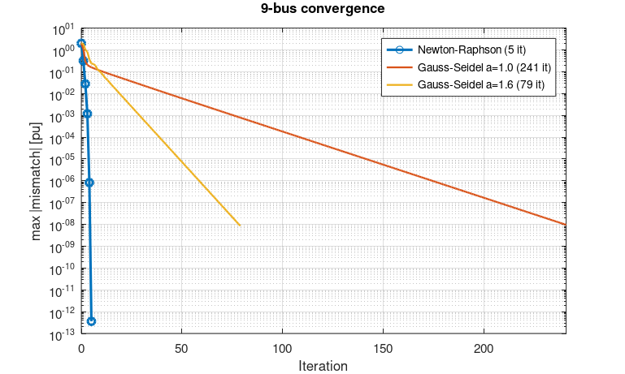

### 실제 단위 환산
기준값: S_base = 30 GVA, V_base = 345 kV, Z_base = 345²/30000 = **3.9675 Ω**

| Bus | 지역 | 종류 | \|V\| [pu] | \|V\| [kV] | θ [deg] | P 주입 [GW] | Q 주입 [GVar] | 판정 |
|---|---|---|---|---|---|---|---|---|
| 1 | 경남 | Slack | 1.0100 | 348.4 | 0.00 | 9.64 | −3.80 | OK |
| 2 | 강원 | PV | 1.0000 | 345.0 | −8.36 | 9.00 | 7.56 | OK |
| 3 | 서울 | PQ | **0.9218** | **318.0** | −18.33 | −60.00 | −6.00 | **저전압** |
| 4 | 전북 | PQ | 1.0174 | 351.0 | −1.03 | −6.00 | −3.00 | OK |
| 5 | 경북 | PQ | 1.0125 | 349.3 | −4.64 | −6.60 | −3.00 | OK |
| 6 | 전남 | PQ(재생E) | 1.0345 | 356.9 | 2.13 | 60.00 | 6.00 | OK |
| 7 | 충북 | PQ | 0.9844 | 339.6 | −9.45 | −3.00 | −1.50 | OK |
| 8 | 경기 | PQ | **0.9459** | **326.3** | −12.44 | −30.00 | −15.00 | **저전압** |
| 9 | 충남 | PQ(재생E) | **0.9432** | **325.4** | −10.58 | 30.00 | 3.00 | **저전압** |

허용전압은 345 kV 계통의 평상시 운전범위 **328~362 kV(약 0.95~1.05 pu)** 를 적용했습니다. 「전력계통 신뢰도 및 전기품질 유지기준」 고시 원문의 수치를 한 번 더 확인하는 것을 권장합니다.

### 선로 부하율 및 손실 (1 pu = 30 GW 가정)
| 선로 | R [Ω] | X [Ω] | P [GW] | \|S\| [GVA] | 부하율 | 손실 [MW] |
|---|---|---|---|---|---|---|
| 4-1 | 0 | 0.229 | −9.64 | 10.44 | 35 % | 0 |
| 7-2 | 0 | 0.248 | −9.00 | 11.76 | 39 % | 0 |
| **9-3** | 0 | 0.232 | 60.00 | 61.69 | **206 %** | 0 |
| 7-8 | 0.034 | 0.286 | 21.83 | 25.82 | 86 % | 195 |
| 9-8 | 0.047 | 0.400 | 8.40 | 9.49 | 32 % | 33 |
| 7-5 | 0.127 | 0.639 | −15.83 | 16.86 | 56 % | 278 |
| **9-6** | 0.155 | 0.674 | −38.40 | 40.98 | **137 %** | 2161 |
| 5-4 | 0.040 | 0.337 | −22.71 | 23.07 | 77 % | 169 |
| 6-4 | 0.067 | 0.365 | 19.44 | 19.66 | 66 % | 204 |

총 손실은 **3.04 GW**(부하의 2.9 %)이고, 그중 71 %가 9-6 선로(전남→충남)에서 발생합니다.

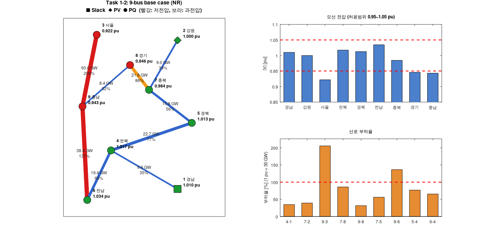

**문제점**
- 서울 부하 60 GW가 충남(9)→서울(3) 단일 경로로만 공급됩니다. 그래서 9-3 부하율이 206 %이고 서울 전압은 0.92 pu입니다.
- 전남 재생E 60 GW가 9-6 선로로 북상하면서 137 % 과부하와 큰 손실이 생깁니다.

---

## Task 1-3. 9모선 안정도 문제 해소방안

| 시나리오 | 내용 | Vmin | Vmax | 최대 부하율 | 손실 [GW] | 과부하 선로 |
|---|---|---|---|---|---|---|
| S0 | 조치 없음 | 0.922 | 1.034 | 206 % | 3.04 | 2 |
| S1 | STATCOM (서울·경기·충남, 1.0 pu 제어) | 1.000 | **1.063** | 200 % | 2.74 | 2 |
| S2 | 수요반응 (서울 부하 10 % = 6 GW 감축) | 0.953 | 1.048 | 184 % | 2.50 | 2 |
| S3 | 선로증설 (9-3 2회선) | 0.962 | 1.047 | 136 % | 2.89 | 3 |
| S4 | HVDC 전남→서울 18 GW | 0.982 | **1.060** | 145 % | 1.43 | 1 |
| **S5** | **S3 + VSC-HVDC 18 GW (양단 전압제어)** | **0.980** | **1.020** | **91 %** | **1.42** | **0** |

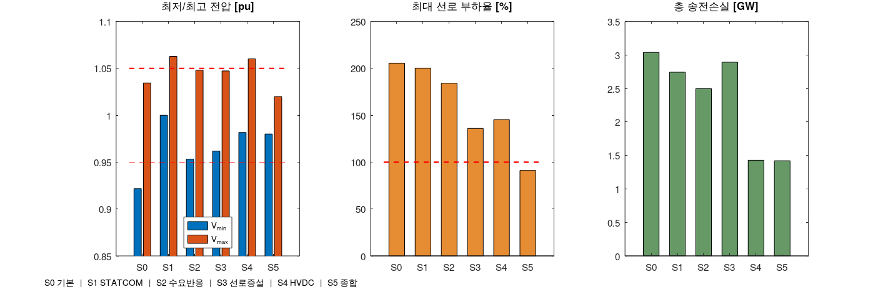

**해석**
- **STATCOM**은 전압을 1.0 pu로 회복시키지만, 유효전력 조류는 그대로라 과부하가 해소되지 않습니다. 또 전남이 1.063 pu로 과전압이 됩니다. 필요한 무효전력도 26.8 GVar로 매우 큽니다.
- **수요반응**은 효과가 있지만 단독으로는 부족합니다.
- **9-3 증설**로 서울 공급 경로를 이중화하면 9-3 문제는 해결됩니다(101 %). 하지만 전남→충남 9-6 과부하(136 %)가 남습니다.
- **HVDC**는 전남 재생E를 AC망을 거치지 않고 서울로 직접 보내서 손실이 절반으로 줄어듭니다(3.04 → 1.43 GW). 다만 AC 조류가 줄어든 만큼 전남 전압이 1.06 pu로 올라갑니다.
- **종합안(S5)**: 9-3 2회선 증설과 **VSC-HVDC**(변환소가 무효전력을 독립 제어, 전남 1.02 pu·서울 1.00 pu 유지)를 함께 적용합니다. 모든 모선이 0.98~1.02 pu, 모든 선로가 91 % 이하가 되고, 손실은 53 % 줄어듭니다.

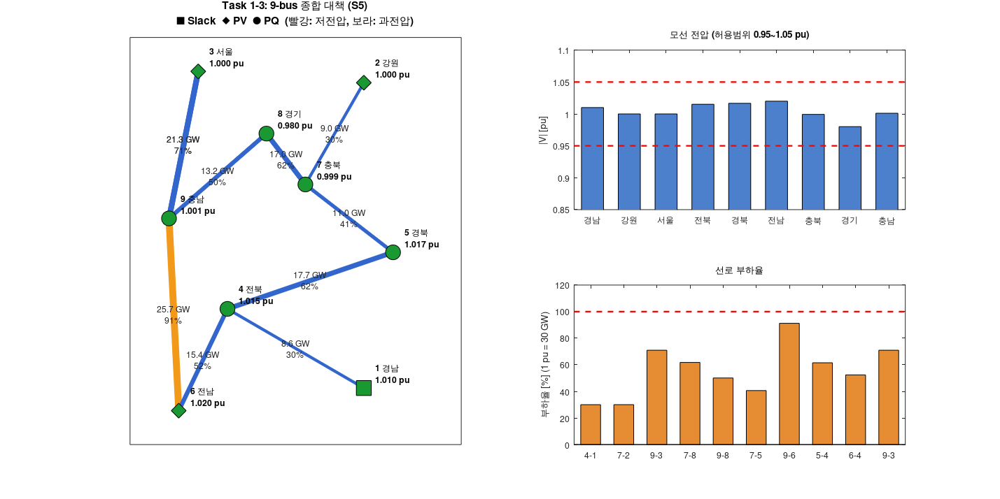

---

## Task 1-4. 대한민국 상세화(KPG193, 194모선) 조류해석

**모델링**
- 9모선과 같은 `nr_pf.m`을 사용했습니다(sparse 자코비안).
- 같은 모선의 발전기 Pg는 합산했고, status = 0인 발전기 15대는 제외했습니다. Slack은 52번(사천)입니다.
- 발전기 Qmax/Qmin을 넘으면 PV→PQ로 전환했습니다(실제 AVR 한계).

**부하 시나리오 (과제에 수치가 없어서 정한 가정)**
| 시나리오 | 가정 | 일반부하 |
|---|---|---|
| 기본부하 | 데이터 그대로 (주어진 발전계획) | 86.5 GW |
| 중부하 | ×1.15 (2024.8 여름 최대전력 97.1 GW 수준) | 99.5 GW |
| 경부하 | ×0.60 (봄·가을 새벽 최저수요 수준) | 51.9 GW |

중부하와 경부하는 급전순위(원자력 → 석탄 → LNG)로 발전을 다시 배분했습니다. 중부하에서는 정지 LNG를 추가 기동하고, 경부하에서는 LNG부터 출력을 줄였습니다.

| 시나리오 | Q한계 PV→PQ | 손실 [MW] | Vmin | Vmax | 전압 위반 | 최대 부하율 | 과부하 선로 |
|---|---|---|---|---|---|---|---|
| 기본부하 | 7개 | 636 (0.74 %) | 1.015 | 1.046 | 0 | 104 % | 4 |
| 중부하 | 8개 | 822 (0.83 %) | 1.016 | 1.043 | 0 | **174 %** | **13** |
| 경부하 | 3개 | 302 (0.58 %) | 1.032 | **1.053** | **2 (과전압)** | 72 % | 0 |

194모선에서도 NR은 세 시나리오 모두 5회 만에 수렴합니다(초기값: 데이터의 위상각, PQ 모선 1.0 pu). Q 한계 처리 후 재계산은 2~3회면 됩니다.

| 기본부하 | 중부하 | 경부하 |
|---|---|---|
| 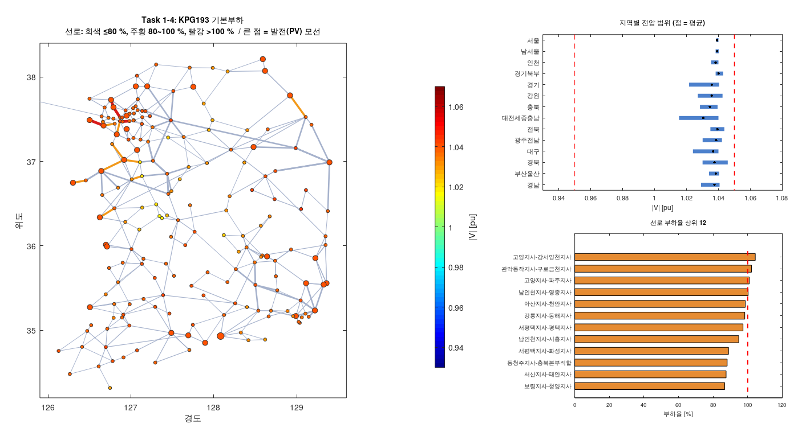 | 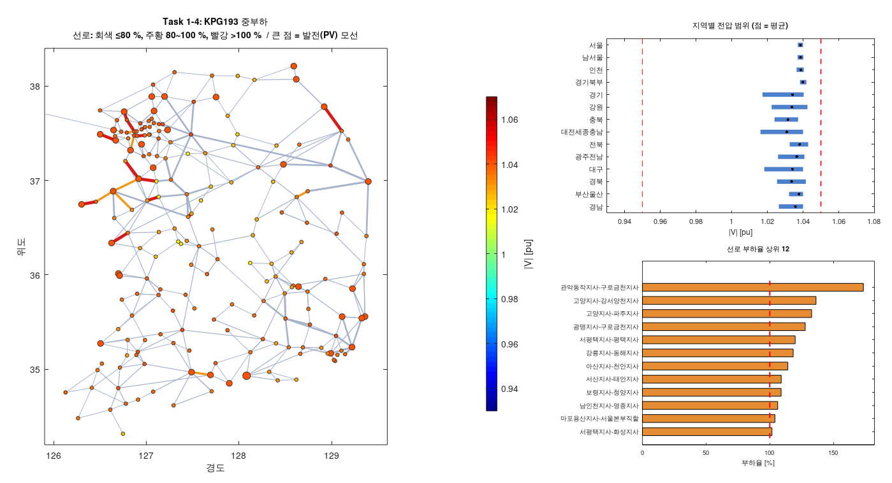 | 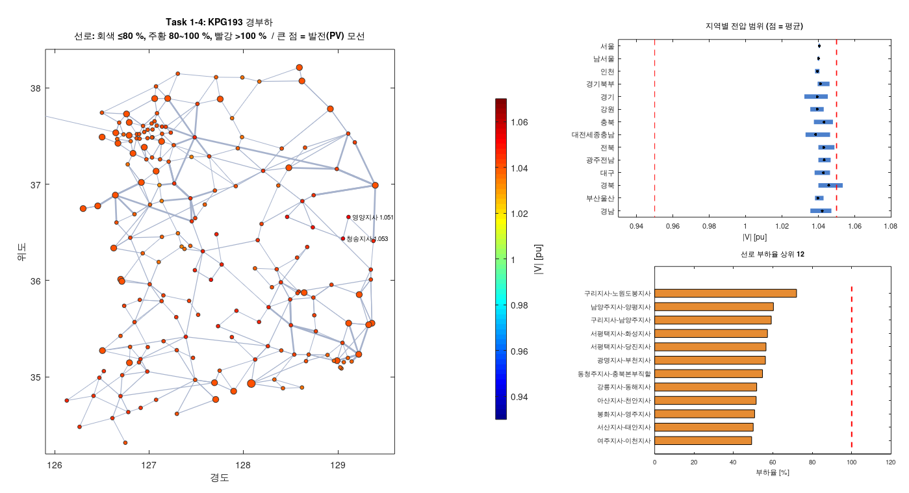 |

**해석**
- **수도권 유입 병목**: 서울(3.3 GW)·남서울(4.5 GW)·경기(5.3 GW)는 순유입 지역이고, 대전세종충남(−8.1 GW)·경북(−3.8 GW)·강원(−3.5 GW)은 순유출 지역입니다. 그래서 수도권 154/345 kV 선로가 먼저 포화됩니다. 기본부하에서도 고양-강서양천(104 %), 관악동작-구로금천(102 %), 고양-파주, 남인천-영종이 100 %를 넘습니다.
- **중부하**에서는 관악동작-구로금천 154 kV가 174 %가 되는 등 과부하 선로가 13개로 늘어납니다. 발전기가 Vg = 1.04로 전압을 잡고 있어서 저전압은 나타나지 않습니다.
- **경부하**에서는 선로 조류가 줄어 선로 충전 무효전력이 남습니다. 그래서 경북 청송(1.053)·영양(1.051)에서 **과전압**이 생깁니다.

---

## Task 1-5. 미래 환경 반영 조류해석

**미래 가정** (`lib/future_def.m`, 제11차 전력수급기본계획의 방향을 참고한 가정값)
| 항목 | 내용 |
|---|---|
| AI·반도체 부하 +10 GW | 용인 반도체 클러스터 6 GW(동·서용인), 수도권 데이터센터 4 GW(김포·시흥·구로금천·안양·고양·하남), 역률 0.98 |
| 재생E +23 GW | 신안 해상풍력 5, 해남 3, 영암 3, 영광 2, 새만금(군산) 3, 부안 2, 영덕 2, 청송 1, 남해 2 GW |
| 석탄 폐지 −11 GW | 충남 보령·태안 석탄 → 태안 LNG 2 GW로 전환 |
| 신규 발전 | 울진 신한울 3·4호기 2.8 GW, 용인 클러스터 LNG 3 GW |
| 미래 최대부하 | 기존 부하 ×1.15 + AI, 재생E 40 % 출력 (여름 저녁) |
| 미래 경부하 | 기존 부하 ×0.60 + AI(24시간 일정), 재생E 100 % 출력 (봄철 낮) |

### 결과 ① – 미래 경부하는 해가 없음 (전압붕괴)
재생E 23 GW를 전량 계통에 넣으면 NR이 **발산**합니다. 원인을 찾기 위해 다른 재생E는 100 %로 두고 **신안(154 kV) 출력만 0→5 GW로 0.1 GW씩 올리며** 연속 조류계산(P-V 곡선)을 했습니다.

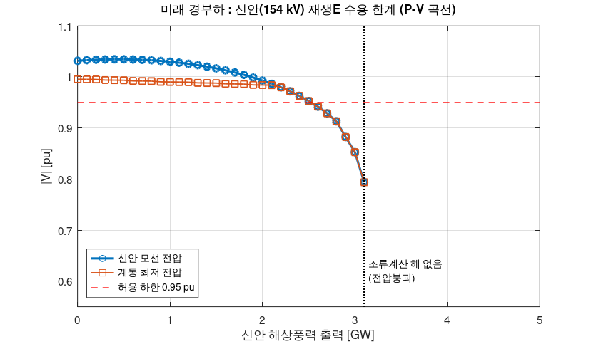

- 신안 전압이 0.95 pu 아래로 떨어지는 지점은 **약 2.6 GW**입니다.
- **약 3.1 GW**를 넘으면 해가 존재하지 않습니다(P-V 곡선의 nose point, 전압붕괴).
- 따라서 기존 154 kV 계통에 연계하면 신안 해상풍력 5 GW 중 **약 2.5 GW를 출력제한**해야 합니다.

### 결과 ② – 현재 vs 미래
| | 수요 [GW] | 재생E [GW] | 손실 [MW] | Vmin | Vmax | 최대 부하율 | 과부하 선로 |
|---|---|---|---|---|---|---|---|
| 현재 중부하 | 99.5 | 2.3 | 822 | 1.016 | 1.043 | 174 % | 13 |
| **미래 최대부하** | 108.1 | 10.2 | 1223 | 1.008 | 1.044 | 129 % | **14** |
| 현재 경부하 | 51.9 | 2.3 | 302 | 1.032 | 1.053 | 72 % | 0 |
| **미래 경부하** (신안 2.5 GW 제한) | 61.2 | 22.1 | **2243** | **0.931** | 1.040 | **186 %** | **29** |

| 미래 최대부하 | 미래 경부하 (출력제한) |
|---|---|
| 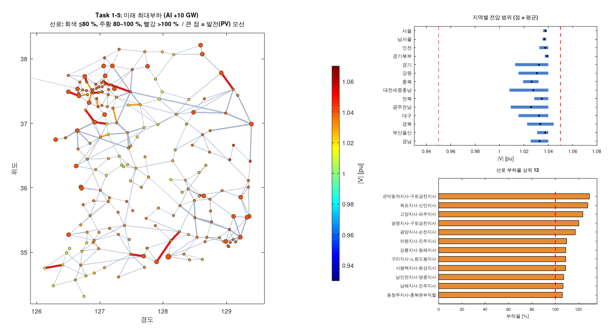 | 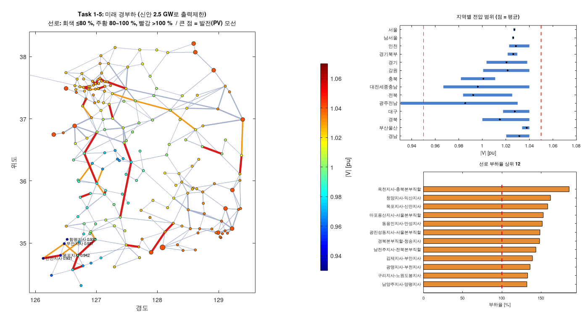 |

**해석**
- **미래의 위험은 피크보다 경부하에서 더 큽니다.** 낮 시간 서남해안 재생E가 수도권으로 장거리 북상하면서 다음 문제가 생깁니다.
  - 옥천-충북(186 %), 청양-익산(162 %), 목포-신안(159 %) 등 **남→북 송전축에 병목**이 생기고 과부하 선로가 29개가 됩니다.
  - 송전손실이 3.7 %로 현재 경부하의 4배입니다.
  - 재생E는 무효전력을 공급하지 않는 negative PQ로 모델링했습니다. 그래서 전압을 지지하는 화력이 빠진 서남부(신안·함평·부안·목포)가 **0.93~0.94 pu 저전압**이 됩니다.
  - 그림의 신안 0.931 pu는 발전기 무효전력 한계를 적용한 값입니다. P-V 곡선은 이 한계를 적용하지 않아서 2.5 GW에서 0.95 pu 이상으로 나왔습니다.
- **미래 최대부하**에서는 용인·수도권 AI 부하 10 GW 때문에 수도권 유입 선로(관악동작-구로금천 129 %, 고양-파주 124 %, 광명-구로금천 120 %)가 과부하됩니다. 목포-신안(128 %)도 과부하입니다.

---

## Task 1-6. 미래 계통 안정도 문제 해소방안

재생E 출력제한 없이 두 미래 시나리오를 모두 만족시키는 것을 목표로 세 단계 대책을 적용했습니다.

**1단계 – HVDC (VSC, 양단 변환소 전압 1.03 pu 제어, 손실 3 %)**
| 링크 | 의미 | 최대부하 송전량 | 경부하 송전량 |
|---|---|---|---|
| 서해안① 신안 → 시흥 | 해상풍력 → 수도권 서부 데이터센터 | 2.0 GW | 4.5 GW |
| 서해안② 영암 → 서용인 | 호남 태양광 → 반도체 클러스터 | 2.0 GW | 4.0 GW |
| 동해안 울진 → 가평 | 동해안 원전 → 수도권 동부 | 4.0 GW | 4.0 GW |

**2단계 – 선로 증설**: 두 시나리오 중 하나라도 100 %를 넘는 선로가 있으면, 가장 심한 선로에 병행 회선을 추가하는 과정을 반복했습니다. 그 결과 **18회선**을 증설했습니다.

증설 선로는 관악동작-구로금천(154), 광명-구로금천(345), 고양-파주(345), 고양-강서양천(154), 강서양천-부천(154), 마포용산-서울(345), 광진성동-서울(345), 남인천-영종(345), 구리-노원도봉(154), 서평택-평택(154), 청양-익산(345), 서천-군산(345), 김제-부안(154), 남전주-전북(154), 영암-해남(345), 강릉-동해(345), 경북-청송(345), 북포항-영덕(154)입니다.

**3단계 – STATCOM**: 1·2단계 후 전압이 모두 0.95~1.05 pu 안에 들어와서 **추가 설치는 필요 없었습니다**. VSC 변환소가 무효전력을 최대 1.3 GVar까지 흡수하며 전압을 제어한 덕분입니다(송전량 대비 약 30 % 이내).

| 단계 | 시나리오 | 수렴 | Vmin | Vmax | 최대 부하율 | 과부하 선로 | 손실 [MW] |
|---|---|---|---|---|---|---|---|
| 0 대책 없음 | 미래 최대부하 | O | 1.008 | 1.044 | 129 % | 14 | 1223 |
| 0 대책 없음 | 미래 경부하 | **X (전압붕괴)** | – | – | – | – | – |
| 1 HVDC | 미래 최대부하 | O | 1.016 | 1.044 | 159 % | 9 | 837 |
| 1 HVDC | 미래 경부하 | **O** | 1.015 | 1.042 | 143 % | 11 | 953 |
| **2 HVDC + 증설** | 미래 최대부하 | O | 1.016 | 1.046 | **100 %** | **0** | **777** |
| **2 HVDC + 증설** | 미래 경부하 | O | 1.019 | 1.043 | **98 %** | **0** | **822** |

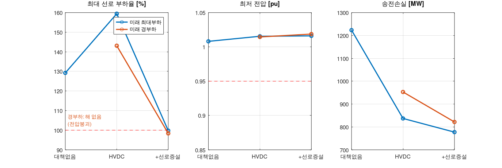

| 대책 후 미래 최대부하 | 대책 후 미래 경부하 |
|---|---|
|  | 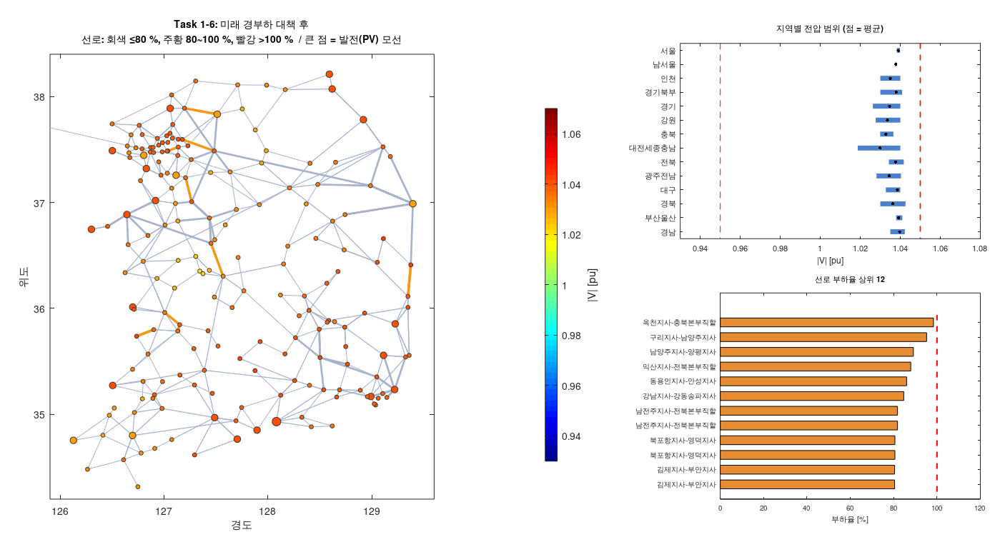 |

**해석**
- **HVDC가 핵심입니다.** 신안 해상풍력을 154 kV 약계통에 직접 연계하는 대신 HVDC로 수도권까지 보냅니다. 그러면 전압붕괴가 사라지고 재생E 24.6 GW를 **출력제한 없이 전량 수용**할 수 있습니다(대책 전에는 해가 없거나 2.5 GW 제한). 장거리 AC 조류가 줄어서 경부하 손실도 2.2 GW에서 0.8 GW로 63 % 감소합니다.
- **HVDC만으로는 부족합니다.** 수전단(시흥·서용인·가평) 주변 154/345 kV 선로로 전력이 다시 퍼지면서 새 과부하가 생깁니다. 최대부하의 최대 부하율이 오히려 129 %에서 159 %로 올라갑니다. 그래서 HVDC를 계획할 때는 **수전단 주변 AC망 보강을 함께** 해야 합니다.
- **선로 증설 18회선**은 수도권 154/345 kV 10회선, 서해안·호남 재생E 연계 5회선, 동해안·경북 3회선입니다. 미래 계통의 병목이 '남→북 장거리 수송'과 '수도권 내부 분배' 두 군데에 있다는 뜻입니다.
- **전압 문제**는 VSC-HVDC 변환소의 무효전력 제어만으로 해결됐습니다. 9모선(Task 1-3)에서 STATCOM만으로는 과부하를 못 푼 결과와 같은 맥락으로, **유효전력 문제는 송전 경로로, 전압 문제는 무효전력 설비로** 풀어야 합니다.

---

## 한계 및 추가로 할 수 있는 것
- **N-1 상정사고 미검토**: 실제 계획은 선로 1개가 고장 나도 100 % 이하여야 합니다. 이를 반영하면 증설량이 더 늘어납니다.
- **재생E 모델**: 재생E를 역률 1의 negative PQ로 두었습니다. 스마트인버터가 무효전력으로 전압을 제어하게 하면 서남부 저전압이 완화됩니다.
- **가정값의 근거**: 부하 배율, AI 부하 위치, 재생E 위치·용량, HVDC 경로는 정책 방향을 참고한 가정입니다. 실제 계획값이 아닙니다.
- **HVDC 모델**: 정상상태에서 변환소를 P 주입/추출 + PV 모선으로 단순화했습니다. 변환소 용량 한계와 제어 동특성은 반영하지 않았습니다.
- **증설 비용**: 선로 길이 데이터가 없어 회선 수로만 비교했습니다.
